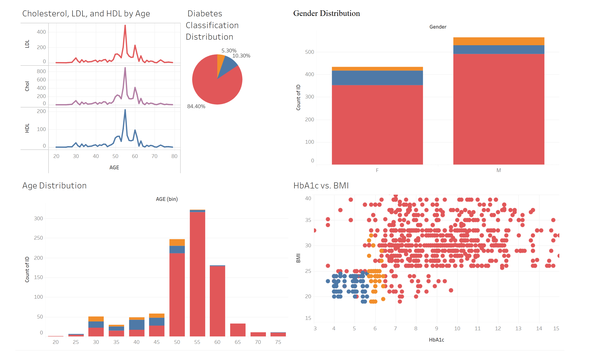

# Diabetes_analysis_Full
# Diabetes Data Analysis Project

## Project Overview
This project analyzes a **Diabetes Dataset** using SQL and Tableau. The goal is to uncover insights about diabetes risk factors, patient demographics, and health indicators such as **HbA1c levels, BMI, Cholesterol, and Age groups**. The analysis helps in understanding trends in diabetes and visualizing key patterns for better decision-making.

## Dataset Information
The dataset contains medical records with attributes such as:
- **AGE** - Patient's age
- **GENDER** - Male/Female
- **HbA1c** - Blood sugar levels (important for diabetes diagnosis)
- **BMI** - Body Mass Index
- **Cholesterol, LDL, HDL** - Lipid profile indicators
- **CLASS** - Diabetes classification (`Y` = Diabetic, `N` = Non-Diabetic, `P` = Pre-Diabetic)

## Project Explanation


## Data Cleaning and Preparation in SQL
Before performing analysis, we first cleaned the dataset using SQL:

### 1. Handling NULL Values
To check for missing values in the dataset:
```sql
SELECT * FROM DiabetesDataset
WHERE AGE IS NULL OR GENDER IS NULL OR HbA1c IS NULL OR BMI IS NULL;
```
To replace NULL values with appropriate defaults:
```sql
UPDATE DiabetesDataset
SET BMI = (SELECT AVG(BMI) FROM DiabetesDataset WHERE BMI IS NOT NULL)
WHERE BMI IS NULL;
```

### 2. Standardizing Gender Values
To replace inconsistent gender values (`F`, `f` → `F`, `M`, `m` → `M`):
```sql
UPDATE DiabetesDataset
SET GENDER = 'F' WHERE GENDER = 'f';
UPDATE DiabetesDataset
SET GENDER = 'M' WHERE GENDER = 'm';
```

### 3. Identifying and Removing Duplicate Entries
Check for duplicates:
```sql
SELECT ID, COUNT(*)
FROM DiabetesDataset
GROUP BY ID
HAVING COUNT(*) > 1;
```
Remove duplicates while keeping the first occurrence:
```sql
DELETE FROM DiabetesDataset
WHERE ID NOT IN (
    SELECT MIN(ID)
    FROM DiabetesDataset
    GROUP BY No_Pation, AGE, GENDER, HbA1c, BMI
);
```

## SQL Analysis Process
### 1. Exploratory Data Analysis (EDA)
- Used `COUNT()`, `AVG()`, and `GROUP BY` to understand the dataset.
- Analyzed **age distribution** and average health indicators.
- Identified **correlations between HbA1c, BMI, and Cholesterol levels**.

### 2. Key SQL Queries
#### 1. Count of Diabetic vs. Non-Diabetic Patients
```sql
SELECT CLASS, COUNT(*) AS total_patients
FROM DiabetesDataset
GROUP BY CLASS;
```
#### 2. Average HbA1c Levels by Age Group
```sql
SELECT 
    CASE 
        WHEN AGE <= 20 THEN '0-20'
        WHEN AGE <= 40 THEN '21-40'
        WHEN AGE <= 60 THEN '41-60'
        ELSE '61-80'
    END AS AgeGroup,
    AVG(HbA1c) AS Avg_HbA1c
FROM DiabetesDataset
GROUP BY AgeGroup;
```
#### 3. Identifying High-Risk Patients (High HbA1c & BMI)
```sql
SELECT ID, AGE, BMI, HbA1c
FROM DiabetesDataset
WHERE HbA1c > 6.5 AND BMI > 30
ORDER BY HbA1c DESC;
```

## Tableau Visualizations
We created **interactive dashboards** in **Tableau** to visualize key insights. Some of the most important visualizations include:

### 1. Age Distribution of Patients
- A **histogram** showing the distribution of ages among patients.

### 2. HbA1c vs. BMI Scatter Plot
- A **scatter plot** identifying relationships between **HbA1c levels and BMI**, helping to detect high-risk individuals.

### 3. Gender Distribution
- A **bar chart** showing the proportion of male vs. female patients.

### 4. Cholesterol, LDL, and HDL Levels by Age
- A **line chart** tracking trends in cholesterol levels with age.

### 5. Diabetes Classification Pie Chart
- A **pie chart** breaking down **diabetic, pre-diabetic, and non-diabetic patients**.

### 6. Full Tableau Dashboard
View the **interactive Tableau dashboard** here: [Diabetes Analysis Tableau Dashboard](https://public.tableau.com/app/profile/mina.wahba/viz/Diabetes_17383887624380/Diabetes_Analysis)

## Screenshots
### Tableau Dashboard


*(Replace `path/to/your/image.png` with the actual paths to your images in the GitHub repository.)*

## How to Run the Project
1. **SQL Analysis**
   - Import the dataset into **PostgreSQL, MySQL, or any SQL database**.
   - Run the SQL scripts provided in the `SQLL.SQL` file.

2. **Tableau Visualization**
   - Open **Tableau Public/Desktop**.
   - Load the dataset (`Dataset of Diabetes CSV`).
   - Import the pre-built Tableau workbook (`Diabetes.twb`).

## Key Takeaways
- Patients with **high HbA1c and BMI are more likely to be diabetic**.
- The **majority of patients fall within the 40-60 age group**.
- **Gender-based patterns** in diabetes prevalence can be explored further.
- **Cholesterol levels increase with age**, and LDL trends correlate with diabetes risk.

## Contributing
Feel free to contribute by improving the analysis, adding visualizations, or refining the queries! Open a **pull request** if you have any suggestions.

## Contact
For any questions or discussions, reach out via **GitHub Issues** or email.

